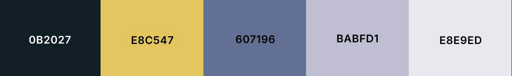
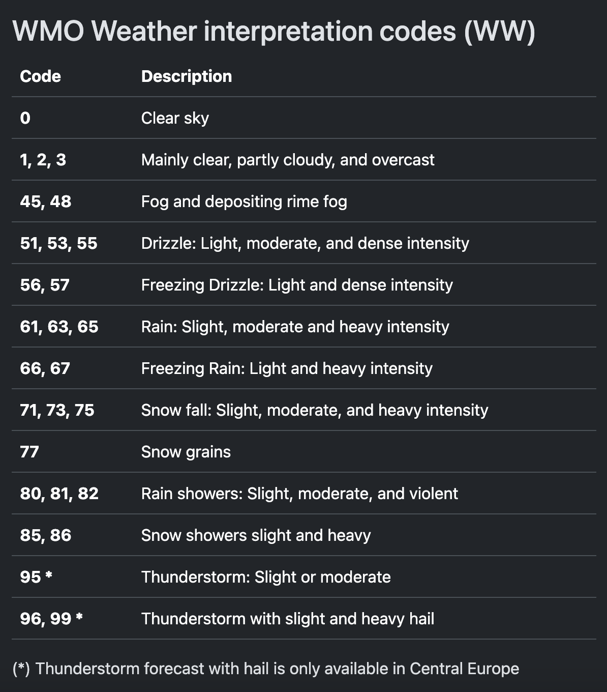
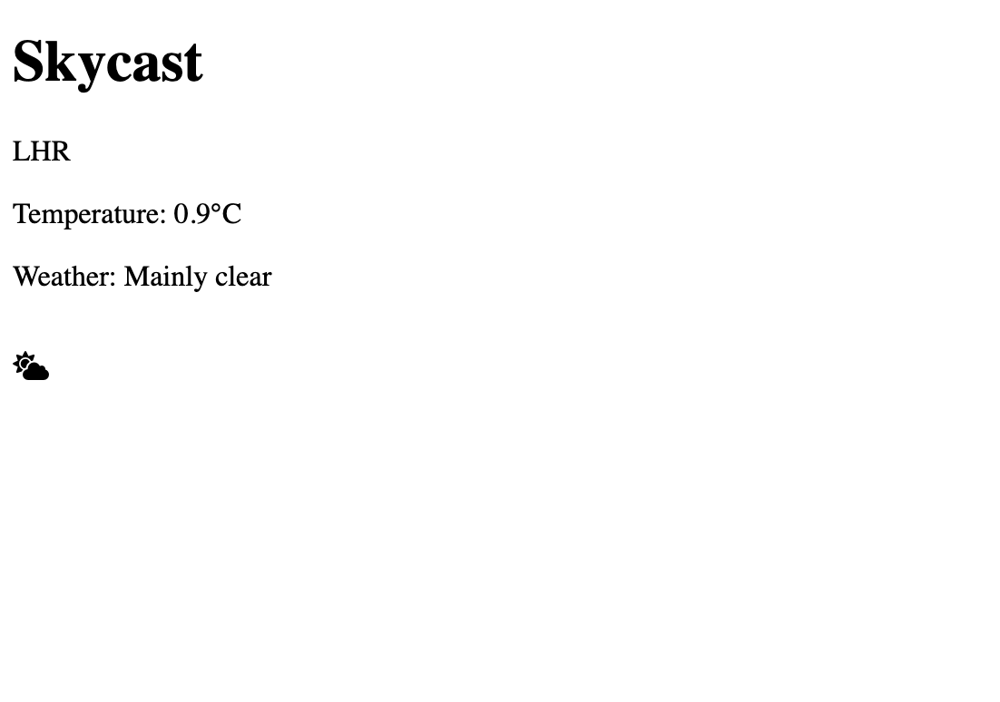

# Skycast - Weather Forecast Web App for Airports

## Project Description
For the Summative One assignment, I have chosen to create a web app that displays the weather for any worldwide airport. This can be used by colleagues in various roles such as schedule manager who may need to make proactive changes due to adverse weather conditions. 

## Project Management
For project management, I have used the Github Projects kanban board to keep track of features and pull requests. 

## Design

### Prototype
The prototype for this app has been created in Figma. A screen recording of the prototype can be found below. \
<video width="320" height="240" controls>
  <source src="docs/figma_prototype_vid.mp4" type="video/mp4">
</video>
Video description: Screen recording of Figma prototype navigating between different pages of the web app \
A link to the Figma file is here https://www.figma.com/design/N3TybZpRVjDRYOr29QqwhH/Summative-1?node-id=0-1&t=BEyxLwm3nyauWsao-1

### Design Choices
#### Colours
Colour palette created using Coolors website https://coolors.co/0b2027-e8c547-607196-babfd1-e8e9ed

Background colour: light grey \
Main text colour: dark grey/blue \
Accent colours: blue and yellow

#### Fonts
For titles and other stylised words: Abril Fatface https://fonts.google.com/specimen/Abril+Fatface \
Main body font: Roboto https://fonts.google.com/specimen/Roboto \
Fallback: Arial

#### Icons
For the weather icons in this app, I am going to use the free library available with Font Awesome. This can be implemented in HTML and scaled/designed using CSS
https://fontawesome.com/icons/categories/weather

### Accessibility
Best practises for web app design have been set out here: https://www.w3.org/WAI/tips/designing/ \
Some of the key takeaways that I will implement are:
- Have high contrast between text and background
- Use large and clear font size
- Design for multiple device types 
- Make everything accessible by keyboard and/or mouse
- Transcript or text descriptions for images and video
- Make html element names useful for screen readers
- Use tools for accessibly testing
https://codedamn.com/news/frontend/7-best-practices-accessible-web-applications

Useful resource to check constrast: 
https://webaim.org/resources/contrastchecker/

## Implementation
### APIs
#### Weather API
I have chosen to use Open Meteo as the API to get the weather data from. This is because it does not require an API key and has a large limit for the number of daily calls (10,000) compared to other APIs that I looked at. It also uses longitude and latitude to locate place so this will be useful for getting to specific airports. 

The Open Meteo API contains weather codes which need to be mapped to descriptions to make them understandable to the user. The mapping from the documentation is below \

#### Geography API
I also needed to use an API for geolocation to turn airport codes into coordinates. I chose to use Searoutes as it had the exact functionality required.

### Minimal Viable Product
The very first iteration of this was created with one hard coded airport to test the ability of calling both APIs. It has not been formatted at all either. \

### Test Driven Development
Accessibility testing: Lighthouse

## Evaluation

