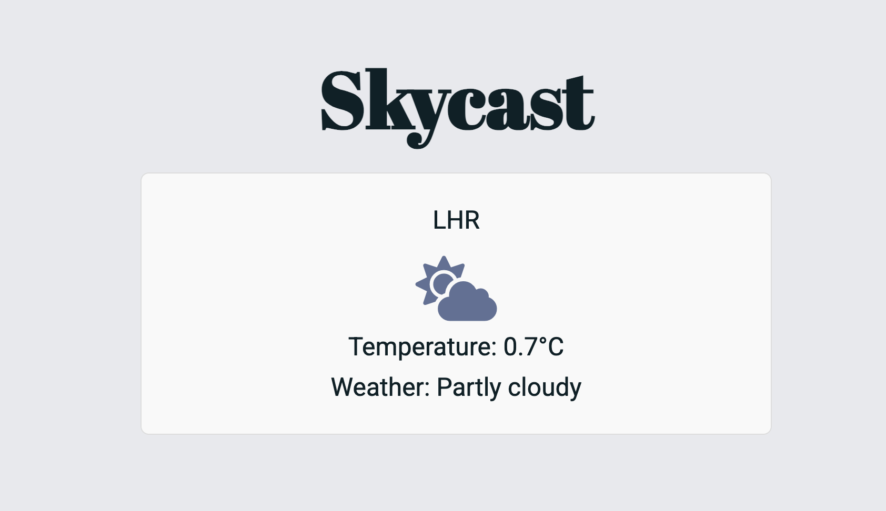
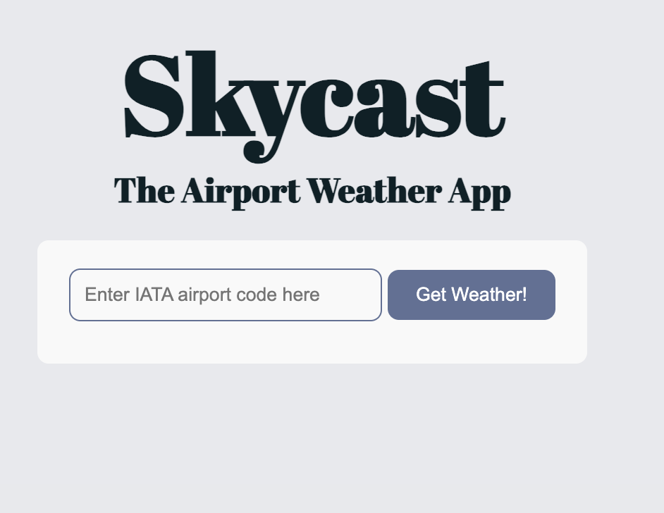

# <h1 align="center">🌦️ Skycast - The Airport Weather App 🌦️</h1>

## Table of Contents
- [🌞 Introduction](#introduction)
- [🛠️ Project Management](#project-management)
- [🎨 Design](#design)
- [💻 Development](#development)
- [🧪 Testing](#testing)
- [📚 Documentation](#documentation)
- [📝 Evaluation](#evaluation)

## <h2 id="introduction">🌞 Introduction</h2>

### Project Description
For the Software Engineering summative one assignment, I have developed a web application designed to provide real-time weather information for any airport around the world. The app is aimed at two different user groups:

**Airline Staff** ✈️ \
This user group includes professionals such as schedule managers who need to make quick, data-driven decisions regarding flight schedules and airport operations. By accessing weather data, they can take steps in responding to adverse weather conditions, such as proactive cancellations, to minimise operational disruption.

**Passengers** 🧳 \
This user group includes travelers who may wish to check the weather conditions at their destination airport, before or during their flight. By providing accurate weather information, passengers can better prepare for their arrival such as by choosing appropriate clothing or planning for potential delays. 

The app is built to be simple and intuitive to use. Because it uses two APIs, users can easily enter an airport code and view the current weather conditions instantly!

### Tech Stack
This is a list of all of the essential tools used to design, develop and deploy the app: \
**HTML** - language used to structure content \
**CSS** - language used to define the visual appearance of the app \
**JavaScript** - language used to create interactivity \
**VS Code** - chosen code editor for development \
**Github** - used for version control and project management \
**Figma** - design tool used for prototyping \
**LocationIQ** - API used to obtain coordinates for airports \
**Open-Meteo** - API used to get current weather for given coordinates \
**Jest** - testing framework for JavaScript

## <h2 id="project-management">🛠️ Project Management</h2>
### Agile Approach
To develop Skycast, I adopted an [Agile](https://www.atlassian.com/agile) approach, breaking the project down into manageable steps to maintain focus on the deadline. I had a 6-week timeline from initial scoping to final app deployment which I split into 2-week sprints, following the [Scrum](https://www.atlassian.com/agile/scrum) principles. Each sprint had a clear sprint goal and work was divided into the following components:

**Epics** - high level goals such as 'Design the app' or 'Build the app' \
**Features** - specific functionalities of the app that contribute to achieving the Epic such as 'Search functionality' \
**Stories** - requirements defined from the user’s perspective for each feature \
**Tasks** - the most granular level, broken down into individual actions and assigned story points to estimate time required

For this project, I used [Github Projects](https://github.com/users/green-eggz/projects/2) to track progress and manage the tickets throughout sprints. A screenshot of the board once the project was finished is attached in Figure 2. I also used story points to estimate the complexity of each task. One story point is equivalent to one hour of work, and each sprint consists of 16 story points, which equates to approximately two off-the-job learning days. Details of each sprint can be found below.

#### Sprint 1
**Sprint Goal:** 
1. Learn the basics of HTML, CSS, JavaScript, and Github. 
2. Create prototype for chosen project 
  
During this sprint, I used Canvas and external resources to learn the fundamentals of software engineering and web development. I also brainstormed project ideas that could be achievable in the 6-week timeframe and were relevant to my workplace (Figure 1). Once I had selected the best idea, I developed a working prototype of the web app, more details of which can be found in the design section. 

 \
*Figure 1: Brainstorming mind map*

#### Sprint 2
**Sprint Goal:** 
1. Build a fully functional app where users can input an airport code and receive the current weather status
   
This sprint was dedicated to the core development of the web app. There were four phases that I wanted to complete during this sprint: setting up the initial environment, creating the weather display, creating the search functionality, and creating the history functionality. During the sprint planning process, I realised that I would not have enough story points to implement the fourth feature so I prioritised the others and left this in the backlog for future improvement. 

#### Sprint 3
**Sprint Goal:** 
1. Test the app for bugs and ensure accessibility
2. Deploy the app
3. Create comprehensive documentation

In the last sprint, I focused on finalising the app so it could be deployed. This included testing the app, publishing it using Github Pages, and creating all of the documentation (including this README file). 

 \
*Figure 2: Final state of kanban board*

## <h2 id="design">🎨 Design</h2>
### Prototype
The prototype for this app was created in [Figma](https://www.figma.com/), an easy to use and free web-based design tool. I used this as an opportunity to map out the app’s visual layout and functionality. The prototype includes the following features:
- A search bar where users can input airport codes
- A main weather display section the shows the current weather conditions and temperature as well as the upcoming weather by hour
- A back button to take the user back to the homepage
- A favourites tab with airports the user search for often
- A history tab with the past search history
- A settings tab which allows the user to switch between light mode and dark mode and between celsius and fahrenheit 

A screen recording of the prototype is available in the docs section of the repository or via [this](https://github.com/green-eggz/se_sum1/blob/main/docs/figma_prototype_vid.mp4) link. For those interested in exploring the prototype interactively, [this](https://www.figma.com/proto/N3TybZpRVjDRYOr29QqwhH/Summative-1?node-id=3-394&t=bevOKXC2TJXO8lkM-1) link provides access to the Figma design.

### Accessibility
To ensure the app is accessible to as many users as possible, I have incorporated best practices for accessible web app design as outlined by [W3C](https://www.w3.org/WAI/tips/designing/). Some of the measures that I was able to implement include:
- Have high contrast between text and background
- Use large and clear font size
- Design for multiple device types 
- Transcript or text descriptions for images
- Make HTML element names useful for screen readers
- Use tools for accessibility testing

### Design Choices
#### Colours
The colour palette that I developed was intended to create a visually appealing yet functional design. Using the [Coolors](https://coolors.co/) website, I selected the following colours:
- Background colour: light grey (#E8E9ED) to ensure the text will contrast well against the background
- Main text colour: dark grey/blue (#0B2027) to be clear and readable
- Accent colours: blue (#607196 & #BABFD1)and yellow (#E8C547) for highlighting important information such as the weather symbol and buttons

All of the colours can be seen side-by-side in Figure 3. 

 \
*Figure 3: Colour palette for app*

#### Fonts
The fonts I chose were intended to be readable and clear but also add to the cohesive design of the app. These fonts include:
- Title font: [Abril Fatface](https://fonts.google.com/specimen/Abril+Fatface) a bold and decorative font
- Main body font: [Roboto](https://fonts.google.com/specimen/Roboto) a modern sans-serif font
- Fallback: Arial a widely supported font if the custom ones fail

#### Icons
The app uses weather icons from the [Font Awesome](https://fontawesome.com/icons/categories/weather) library to visually represent weather conditions. I chose this library because the icons can be customised with CSS to change colours and size, which will align with the app's overall aesthetic. These symbols allow the user to understand weather conditions at a glance without having to read the weather description.

## <h2 id="development">💻 Development</h2>
### APIs
#### Weather API
For the weather data, I chose to use the [Open-Meteo](https://open-meteo.com/) API because it met all of my requirements. Firstly, it does not require an API key which made development even easier for me as a beginner. The API also supports up to 10,000 calls per day which is ideal for my app as it could be delivered to many users. Finally, it takes longitude and latitude coordinates as the input which ensures the weather data can be specific to individual airports. 

The Open-Meteo API returns weather codes that represent various weather conditions such as clear skies, thunderstorms, snow, etc. To enhance the user experience, I mapped these codes to readable descriptions and weather icons using information provided in the Open-Meto documentation (Figure 4). 

 \
*Figure 4: Open-Meteo documentation screenshot*

#### Geography API
To convert [IATA airport codes](https://www.iata.org/en/publications/directories/code-search/) into longitude and latitude coordinates, I initially used the [Searoutes](https://developer.searoutes.com/reference/getgeocodingairport) API, which was designed for this exact purpose. However, the free version only allowed 100 calls per account, which became a limitation as development progressed.

I switched to using [LocationIQ](https://locationiq.com/), another geocoding API that converts location inputs into coordinates. This API has a much higher free call limit, 5,000 per day, which was better suited for my purposes. Although not built specifically for airports like Searoutes was, the JSON response from this API contains several attributes that provide detailed information about the location, including ```class``` and ```type```. The response can be filtered to only select those where ```class = aeroway``` and ```type = aerodrome``` to narrow down the search to airports only. 

Switching APIs required reworking some code but ultimately provided a better long-term solution for the app.

### Minimal Viable Product (MVP)
The development of the app began with a focus on creating an MVP to validate the core functionality before expanding the features. The initial iteration featured one hardcoded airport (LHR) to verify that the APIs could work together. The focus was on fetching coordinates from the geography API and using these coordinates to retrieve weather data from Open-Meteo. The information was displayed in an unformatted manner at this stage as working code was more important than design (Figure 5). 

 \
*Figure 5: First iteration*

After confirming that the APIs worked together correctly, I refined the app by implementing my chosen design using CSS. This created a more professional appearance and looked much more how I had intended it to when I was prototyping (Figure 6). 

 \
*Figure 6: Second iteration*

At the next stage, I went on to include the search bar which allows users to input airport codes dynamically rather than being hardcoded in the JavaScript file (Figure 7). At this stage, I also introduced error handling so that in cases where invalid airport codes or non-airport locations are entered, error messages guide the user to provide the correct input (Figure 8). 

 \
*Figure 7: Third iteration*

 \
*Figure 8: Error code example*

### Version Control
Throughout development, I used GitHub to manage and track changes. Each feature was developed on a separate branch, allowing for isolated testing and debugging before merging into the main branch. I frequently made commits and used descriptive messages to explain what was happening at that time, for example ‘Added error message for incorrect user input’ and ‘Changing style of search box’. Although I was the only developer on this project, I still reviewed all changes through pull requests to stay consistent with best practices for coding. 

## <h2 id="testing"> 🧪 Testing</h2>
### Test Driven Development
I followed a [TDD](https://www.geeksforgeeks.org/test-driven-development-tdd/) approach to verify individual components of my application which involved using Jest to build unit tests for individual functions. The first test was what is known as a ‘smoke test’, a test designed to check that everything is configured correctly. This test passed successfully, as shown in Figure 9, and so moved on to testing my application. I developed a unit test to validate that the app only accepts the correct input for the airport code. The test checks whether the input adheres to the standard 3-character IATA code format and any invalid input is flagged. To automate testing, I set up a GitHub Actions workflow. This pipeline triggers the tests every time a pull request is created or updated. 

 \
*Figure 9: Smoke test example*

### Accessibility
Accessibility testing was important to guarantee that the app could be used by as many people as possible. I used [Google Lighthouse](https://developer.chrome.com/docs/lighthouse/overview) to measure the accessibility and performance of the app. The tool determined that Skycast scored very highly within the accessibility and performance measures, as shown in Figure 10. It also suggested some manual tests to perform such as checking that the page has a logical tab order and that HTML tags are descriptive for assistive technology. To confirm that the colour palette met accessibility standards, I used a [contrast checker tool](https://webaim.org/resources/contrastchecker/). This validated that the contrast ratio between the text and background colors met the standards to ensure readability for those with visual impairments (Figure 11).

 \
*Figure 10: Lighthouse accessibility testing*

 \
*Figure 11: Background and foreground contrast check*


## <h2 id="documentation">📚 Documentation</h2>
### User Documentation
#### 👋 Welcome!
Skycast is a web application that provides real-time weather information for airports worldwide. Users can simply input an airport's IATA code (e.g. LHR for London Heathrow) to retrieve the current temperature and weather conditions.

#### 🏃 Getting Started

- Open the Skycast web app in your browser (the link can be found in the About section of this Github repository or [here](https://green-eggz.github.io/se_sum1/))
- Enter the 3-character IATA airport code in the search box 
- Click the ‘Get Weather!’ button
- View the current weather information which includes:
  - Temperature
  - Weather condition description
  - Weather condition symbol
- Simply type in a new airport code in the search bar to start again! 

#### 🚩 Troubleshooting
**'No airport found for the provided code:'** Ensure you enter a correct 3-character IATA airport code. For example, 'XXX' is not a valid code. \
**'Please enter a valid 3-letter IATA airport code':** Ensure that you only enter 3 letters, any other combination of characters including numbers or more than 3 letters will not work. 

### Technical Documentation
#### ℹ️ Overview
Skycast is built using a simple tech stack that includes HTML, CSS, JavaScript, and external APIs for weather and geolocation data. 

#### 📐 App Structure
- The app ensures only valid IATA airport codes are accepted
- The input airport code is sent to LocationIQ for to obtain the longitude and latitude coordinates
- Coordinates are retrieved and passed to Open-Meteo to get current weather details
- Data is formatted into user-friendly descriptions and icons

#### 📋 Instructions
- Clone the Github repository 
  - ```git clone  https://github.com/green-eggz/se_sum1.git```
- Navigate to the project directory
  - ```cd se_sum1```
- Install dependencies
  - ```npm install```
- Run the tests
  - ```npm test```
- Run the application by double clicking on the HTML file


**Main Files:** \
```index.html```: Main HTML file \
```styles.css```: CSS file for styling \
```app.js```: JavaScript file containing the main logic \
```app.test.js```: JavaScript file containing unit tests

#### 🚫 Limitations
- Limited to airports with available geolocation data in LocationIQ
- Free-tier API restrict usage to 10,000 daily calls for Open-Meteo and 5,000 for LocationIQ
- Open-Meteo weather data updates every 15 minutes

## <h2 id="evaluation">📝 Evaluation</h2>
### Future Improvements
One significant improvement I would like to make is to break down the large chunks of JavaScript code into functions. This would improve the readability of the code and make it both easier to maintain and reuse. Using more functions would also allow for better unit testing as it is easier to create unit tests for functions. There are also some additional functionalities that I wanted to include but did not have time to. These included allowing users to view a history of recently searched airport codes, introducing a loading bar animation during slow API calls, and adding an hourly weather forecast for the rest of the day. Furthermore, in future sprints I would increase the scope of the accessibility testing to ensure compatibility with screen readers, tablets, and other devices that users may require. 

### Conclusion
This project was a strong starting point in my software engineering journey. While the prototype was ambitious, I successfully delivered the core functionality of the app which was to display weather for worldwide airports. Although some features, such as additional tabs and upcoming weather, were left out of this version, I still gained valuable insights into web development and  Agile practices. I believe that Skycast has the potential to be a practical tool for anyone who wants to know the weather at an airport and I look forward to making further improvements!

